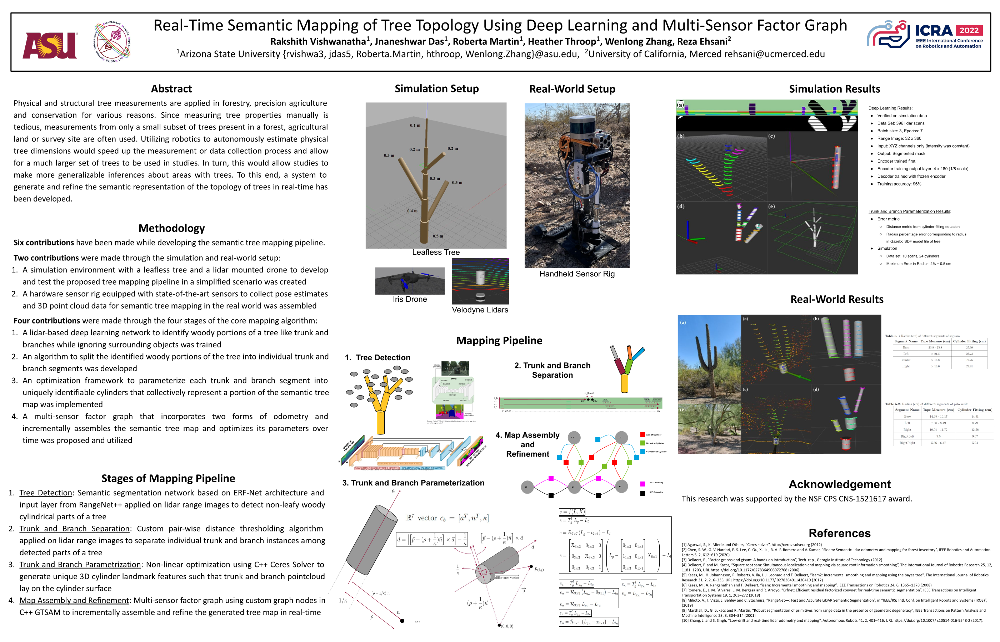

# tree-mapping-ros2

ROS 2 (Jazzy) port of the *Real-Time Semantic Mapping of Tree Topology
Using Deep Learning and Multi-Sensor Factor Graph* pipeline.



## Pipeline overview

| # | Stage                       | Original code                                                                         | Port target              |
|---|-----------------------------|---------------------------------------------------------------------------------------|--------------------------|
| 1 | Tree detection (DL)         | `erfnet_tree_mapping/eval/` (PyTorch, ERFNet on lidar range images)                   | `tree_mapping_dl/` (Phase C, pending) |
| 2 | Trunk / branch separation   | `branchInstanceSegmentation{,_continuous}.cpp`                                        | `tree_mapping_geometry/` (done) |
| 3 | Cylinder parameterization   | `cylinderFitting{,_BasePoint,_ResidualEval,_Data}.{cpp,h}` (Ceres optimization)       | `tree_mapping_geometry/` (done) |
| 4 | Map assembly & refinement   | `gtsam_2d_zAxisCylinders.cpp`, `main_GtsamHelper.{cpp,h}` (GTSAM)                     | `tree_mapping_graph/` (Phase B, pending) |

Phase D (light Python utilities like `position_control_rover.py`,
`tf_velodyne.py`, `lidar_path.py`) is queued but not high priority — the
rover platform that consumes this repo already has comparable
infrastructure.

## Layout

| Package                  | Build type     | What it ports                                                      |
|--------------------------|----------------|--------------------------------------------------------------------|
| `tree_pointcloud_viz`    | `ament_cmake`  | XYZ-text loader → latched `sensor_msgs/PointCloud2` for RViz / WUR-tropical-tree dataset visualization. |
| `tree_mapping`           | `ament_python` | Skeleton for the OFFBOARD/MAVROS Python ports (`probe_docking.py`, `position_control_rover.py`). Python sources to be filled in Phase D. |
| `tree_mapping_geometry`  | `ament_cmake`  | Stages 2 & 3 of the pipeline — branch instance segmentation and Ceres-based cylinder fitting (C++17, PCL 1.14, OpenCV 4, Ceres 2). |

The original `velodyne_simulator/`, Gazebo Classic worlds, ROS 1 PX4
SITL launches, the `GAAS/` tutorial tree, the KITTI conversion
utilities, and the `collectVelodyneData*` bag dumpers are intentionally
**not** ported. The downstream consumer (an Earth Innovation Hub rover
platform) has its own ROS 2 native VLP-16 + `velodyne_driver` chain,
PX4 / MAVROS bridge, and bag recording.

## Build

```bash
sudo apt install -y libceres-dev libgoogle-glog-dev libgflags-dev   # one-time
git clone https://github.com/Earth-Innovation-Hub/tree-mapping-ros2.git src/tree-mapping-ros2
source /opt/ros/jazzy/setup.bash
colcon build --packages-select \
    tree_pointcloud_viz tree_mapping tree_mapping_geometry \
    --symlink-install
source install/setup.bash
```

## Use

### Visualize the WUR tropical-tree clouds

```bash
ros2 launch tree_pointcloud_viz tree_pointcloud_viz.launch.py \
    input_dir:=/path/to/dataset/4_LidarTreePointCloudData \
    file_list:='["GUY01_000.txt","GUY02_000.txt","GUY03_000.txt"]'
```

### Cylinder-fitting residual evaluator (regression / sanity check)

Reproduces the residual values from the upstream
`cylinderFitting_ResidualEval` test binary. Useful to verify that the
Ceres + Eigen port still produces the exact same numbers as the original
ROS 1 catkin build.

```bash
# args:  file_num  rho     kappa  theta   phi    alpha
ros2 run tree_mapping_geometry cylinder_fitting_residual_eval \
    0 2.0 1.0 1.5707963267948966 1.5707963267948966 0.0
```

### Cylinder fitter (full optimizer + RViz markers)

Loads a per-segment PCD point cloud, computes the analytic initial
estimate (axis-line PCA, mean ring radius, n_theta / n_phi_bar basis),
and refines (rho, kappa, theta, phi, alpha) with Ceres' auto-diff
Levenberg-Marquardt solver, then republishes the source cloud and the
fitted cylinder as `MarkerArray`.

Synthetic mode (no PCDs needed):

```bash
ros2 launch tree_mapping_geometry cylinder_fitter.launch.py mode:=manual file_num:=0
```

Real-tree mode (against the upstream test set):

```bash
ros2 launch tree_mapping_geometry cylinder_fitter.launch.py \
    mode:=real file_num:=0 \
    base_path:=/path/to/test_cylinders_simulation/from_bags_live_2021-09-01_16-30-17/
```

#### Validation against upstream

The port reproduces the upstream README's reference table to 6
significant figures (per-branch radii on the 2021-09-01 live tree scan):

| `file_num` | branch                  | upstream r [m]            | port r [m] |
|------------|-------------------------|---------------------------|------------|
| 0          | `_base`                 | 0.12634136960388964       | 0.126341   |
| 1          | `_base_wTrans`          | 0.14512224962743242       | 0.145122   |
| 2          | `_left`                 | 0.083676066395241541      | 0.083676   |
| 4          | `_left_wOutlierRingOnly`| 0.087997618743898318      | 0.087998   |
| 5          | `_right`                | 0.1256250843095913        | 0.125625   |
| 6          | `_rightleft`            | 0.090725929243689774      | 0.090726   |
| 7          | `_rightright`           | 0.052456760430584705      | 0.052457   |

### Branch instance segmenter (range-image clustering)

Loads a per-tree PCD, projects it to a spherical range image, range-band
filters around the tree base (so the segmenter only sees that one tree),
then walks the image bottom-up and clusters pixels along each row using
a simple `d_thresh` neighbour-distance test. Outputs `cloud_original`,
`cloud_filtered`, an instance-coloured `cloud_instance` (intensity =
instance idx + 1), the colourised range image, plus a per-pixel
`branch_instances_*.txt` mask CSV.

The upstream binary baked the per-cloud `(base_xyz, eps_before,
eps_after)` table directly into a `switch` on `file_num`. We preserve
that table as a fallback for `file_num` 0–10 (drop-in for the upstream
test set), but also expose `base_xyz`, `eps_before`, `eps_after` as
ROS 2 parameters so the node works on arbitrary clouds.

```bash
# Upstream test set (uses baked-in defaults for file_num):
ros2 launch tree_mapping_geometry branch_segmenter.launch.py \
    base_path:=/path/to/pcd_for_instance_seg/ \
    file_num:=0 d_thresh:=0.33

# Arbitrary cloud (manual override):
ros2 launch tree_mapping_geometry branch_segmenter.launch.py \
    base_path:=/path/to/clouds/ \
    output_dir:=/tmp/branch_seg_out/ \
    file_num:=0 \
    base_xyz:='[7.5, 0.0, 0.0]' eps_before:=10.0 eps_after:=10.0 \
    angular_resolution_x_deg:=0.2 angular_resolution_y_deg:=0.2 d_thresh:=0.33
```

Smoke tests on the original test data:

| PCD                              | n points | image (HxW)  | clusters | result |
|----------------------------------|----------|--------------|----------|--------|
| `pcd_xyzir/cloud0_0.000000.pcd`  | 10477    | 121x1800     | 15       | dominant cluster 0 (3598 px), branches 5 (2627), 11, 3, 14, ... |
| `pcd/cloud20_20.000000.pcd`      | 9943     | 121x1799     | 15       | 12166 cluster pixels assigned across 15 IDs |

The algorithm itself is a line-by-line port (range-band filter,
recursive `increase_idx_check` turned into an iterative loop, identical
row-counter / relabelling logic).

### MAVROS OFFBOARD reference port (Phase D, pending)

```bash
ros2 launch tree_mapping offboard_demo.launch.py    # Phase D, not yet implemented
```

## Origins and acknowledgments

This package is a ROS 2 (Jazzy, C++17, GTSAM 4.x, PCL 1.14, OpenCV 4,
Ceres 2) port of research that originated as Rakshith Vishwanatha's M.S.
thesis at Arizona State University, advised by Jnaneshwar Das (co-author
and project PI).

The full project poster (presented at ICRA 2022) is preserved verbatim
under [`docs/tree_mapping_poster.pdf`](docs/tree_mapping_poster.pdf):

> **Real-Time Semantic Mapping of Tree Topology Using Deep Learning and
> Multi-Sensor Factor Graph.**
> Rakshith Vishwanatha, Jnaneshwar Das, Roberta Martin, Heather Throop,
> Wenlong Zhang (Arizona State University); Reza Ehsani (University of
> California, Merced).
> ICRA 2022.

The original ROS 1 catkin / Gazebo Classic / GTSAM 3.x / PyTorch 0.4
implementation is at
[`DREAMS-lab/tree-mapping`](https://github.com/DREAMS-lab/tree-mapping)
(last upstream commit 2020-09-16). This repository does **not** vendor
that ROS 1 tree; it carries only the ROS 2 reimplementations and the
historical poster.

This work was supported in part by **NSF CPS award CNS-1521617**.

## Datasets referenced

* [WUR Terrestrial Lidar of Tropical Forests](http://lucid.wur.nl/datasets/terrestrial-lidar-of-tropical-forests)
* [Velodyne Simulator (Dataspeed Inc.)](https://bitbucket.org/DataspeedInc/velodyne_simulator/src/master/)

## License

[MIT](LICENSE). Copyright (c) 2026 Earth Innovation Hub and contributors.

## Phase A scope status

| Output                              | Source(s) ported                                            | Status |
|-------------------------------------|-------------------------------------------------------------|--------|
| `cylinder_fitting_residual_eval`    | `cylinderFitting_ResidualEval.cpp`, `cylinderFitting_Data.h` | done — residuals at machine epsilon |
| `cylinder_fitter_node`              | `cylinderFitting.cpp` (+ `_BasePoint`)                       | done — matches upstream radii to 6 sig figs across all 7 reference cases |
| `branch_segmenter_node`             | `branchInstanceSegmentation.cpp` (+ `_continuous`)           | done — smoke-tested on `cloud0` and `cloud20`; iterative `increase_idx_check`, ROS 2 parameters for `(base_xyz, eps_before, eps_after)` |
| `tree_mapping_geometry_utils` (lib) | `main_UtilsAndParams.{cpp,h}`, `pcd_custom_types.h`          | done   |
