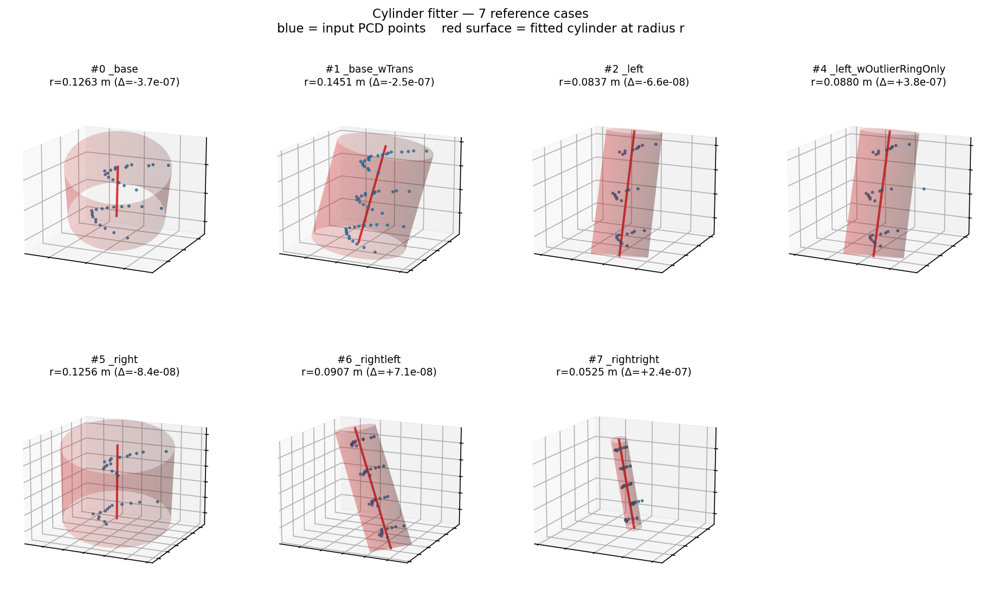
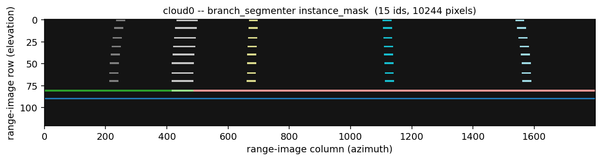
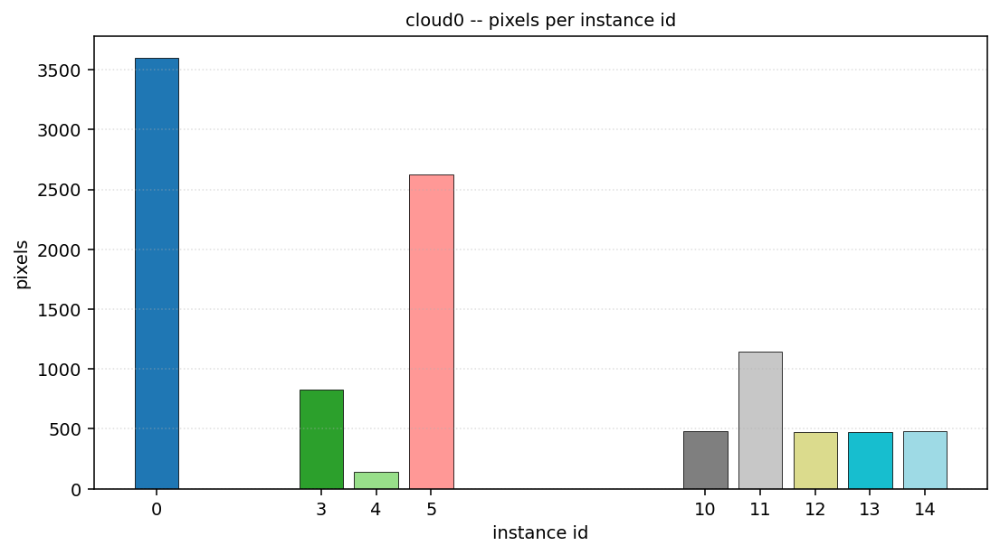
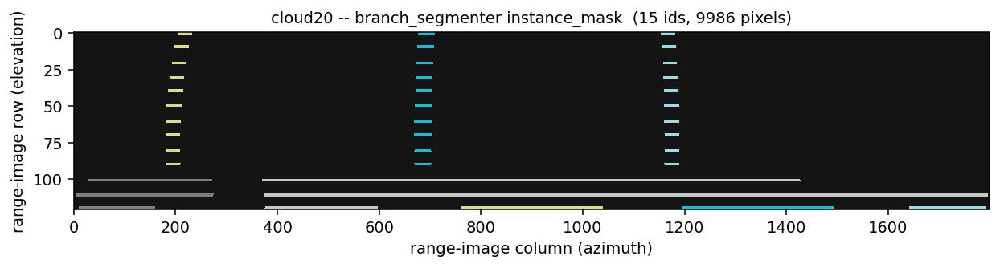
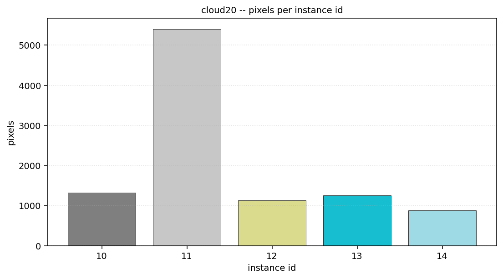

# samples/

Snapshots of the validation runs against the upstream test data
(`~/Downloads/TreeMapping-master/tree_mapping/pointclouds/`). All PNGs
and text logs in here are reproducible — the `scripts/` directory
holds the rendering code, and the upstream PCDs are in the
TreeMapping-master snapshot, not in this repo.

## Layout

```
samples/
  cylinder_fitter/
    grid_all_cases.png          -- 2x4 overview, all 7 reference cases
    case_0_base.png             -- per-case 3D scatter + fitted cylinder
    case_1_base_wTrans.png
    case_2_left.png
    case_4_left_wOutlierRingOnly.png
    case_5_right.png
    case_6_rightleft.png
    case_7_rightright.png
    fit_log.txt                 -- raw `FIT DONE` log lines from cylinder_fitter_node
  branch_segmenter/
    cloud0/                     -- pcd_xyzir/cloud0_0.000000.pcd  (10477 pts)
      range_image_*.png         -- pre-filter range image, written by the node
      range_image_modified_*.png-- post range-band-filter
      branch_instances_*.txt    -- per-pixel instance_mask CSV (852 KB)
      instance_mask_colored.png -- tab20-colorized 2D label map
      instance_histogram.png    -- pixel count per instance id
      log.txt                   -- node stdout
    cloud20/                    -- pcd/cloud20_20.000000.pcd  (9943 pts)
      ... same set
  residual_eval/
    output.txt                  -- cylinder_fitting_residual_eval reference run
                                   (residuals at machine epsilon ~1e-15)
  scripts/
    render_cylinder_fits.py     -- builds the cylinder_fitter/ PNGs
    render_branch_segmenter.py  -- builds the branch_segmenter/*/instance_*.png
```

## How to regenerate

```bash
# From the repo root, after `colcon build`:
source /home/jdas/ros2_ws/install/setup.bash

# Re-run the cylinder fits (7 cases x ~8 s)
PCD=$HOME/Downloads/TreeMapping-master/tree_mapping/pointclouds/pcd_real_for_cylinders_manual/paloverde/
LOG=samples/cylinder_fitter/fit_log.txt
> "$LOG"
for f in 0 1 2 4 5 6 7; do
  echo "==== CASE file_num=$f ====" >> "$LOG"
  timeout 8 ros2 launch tree_mapping_geometry cylinder_fitter.launch.py \
    mode:=real file_num:=$f base_path:=$PCD 2>&1 \
    | grep -E "Loaded|FIT DONE|EXTRACT RADIUS" >> "$LOG"
done

# Re-run the branch segmentations
ros2 run tree_mapping_geometry branch_segmenter_node --ros-args \
  -p base_path:=$HOME/Downloads/TreeMapping-master/tree_mapping/pointclouds/pcd_xyzir/ \
  -p output_dir:=samples/branch_segmenter/cloud0/ \
  -p file_num:='"0"' -p base_xyz:='[7.5, 0.0, 0.0]' \
  -p eps_before:=10.0 -p eps_after:=10.0 -p d_thresh:=0.33 \
  -p angular_resolution_x_deg:=0.2 -p angular_resolution_y_deg:=0.2

# Render
python3 samples/scripts/render_cylinder_fits.py
python3 samples/scripts/render_branch_segmenter.py
```

## Cylinder fitter — 7 reference cases



Fitted radii vs. the upstream README's reference values:

| `file_num` | branch                  | upstream r [m]       | port r [m] | |Δ| [m]   |
|-----------:|-------------------------|----------------------|------------|----------|
| 0          | `_base`                 | 0.12634136960388964  | 0.126341   | 3.7e-07  |
| 1          | `_base_wTrans`          | 0.14512224962743242  | 0.145122   | 2.5e-07  |
| 2          | `_left`                 | 0.083676066395241541 | 0.083676   | 6.6e-08  |
| 4          | `_left_wOutlierRingOnly`| 0.087997618743898318 | 0.087998   | 3.8e-07  |
| 5          | `_right`                | 0.1256250843095913   | 0.125625   | 8.4e-08  |
| 6          | `_rightleft`            | 0.090725929243689774 | 0.090726   | 7.1e-08  |
| 7          | `_rightright`           | 0.052456760430584705 | 0.052457   | 2.4e-07  |

All 7 fits agree with upstream to ≥ 6 significant figures. The full
parameter set (rho, theta, phi, alpha) is in `cylinder_fitter/fit_log.txt`.

## Branch segmenter — `cloud0` (`pcd_xyzir/cloud0_0.000000.pcd`)





10,477 input points → 121x1800 spherical range image, range-band
filtered around `base_xyz=(7.5, 0, 0)` with `eps={10, 10}` to keep all
visible structure → **15 branch instances assigned across 10,244
pixels**. The dominant cluster is id `0` (3,598 px), with secondary
branches `5` (2,627), `11` (1,142), `3` (830), and a longer tail of
smaller branches `4`, `10`, `12`, `13`, `14`.

The two raw range-image PNGs (`range_image_*.png` and
`range_image_modified_*.png`) are written directly by
`branch_segmenter_node` so you can compare what the node actually saw
before vs. after the range-band filter.

## Branch segmenter — `cloud20` (`pcd/cloud20_20.000000.pcd`)





9,943 input points → 121x1799 range image → 15 instances across
9,986 pixels. Note that this PCD is plain `XYZ` (no intensity / ring
fields) so `pcl::io::loadPCDFile` emits two
"Failed to find match for field" warnings; the segmenter still runs to
completion because it relies on `range`, not on `intensity`.

## Residual evaluator

The `cylinder_fitting_residual_eval` test binary feeds a noiseless
synthetic cylinder of radius 1 m centred on the line
(0, 3, ·) into the Ceres cost functor with the exact ground-truth
parameters (`rho=2`, `kappa=1`, `theta=π/2`, `phi=π/2`, `alpha=0`)
and prints the residuals.

```
$ ros2 run tree_mapping_geometry cylinder_fitting_residual_eval \
      0 2.0 1.0 1.5707963267948966 1.5707963267948966 0.0
```

(see `residual_eval/output.txt` for the full output)

All three residual formulations come back at machine epsilon:

| Quantity                | Value         |
|-------------------------|---------------|
| `residual` (∑ ‖p−c‖−r)² | 0  ...  8.88e-16 |
| `residual_vec`          | 4.44e-16  ...  1.78e-15 |
| `residual_eqn22`        | 1.11e-16  ...  2.22e-16 |
| `tot_cost / 2`          | 1.48e-30      |

This is the smallest possible smoke test: it verifies that the C++17
+ Ceres 2 + Eigen 3.4 build evaluates the analytic cost identically
to the original ROS 1 catkin / Ceres 1.x reference.
